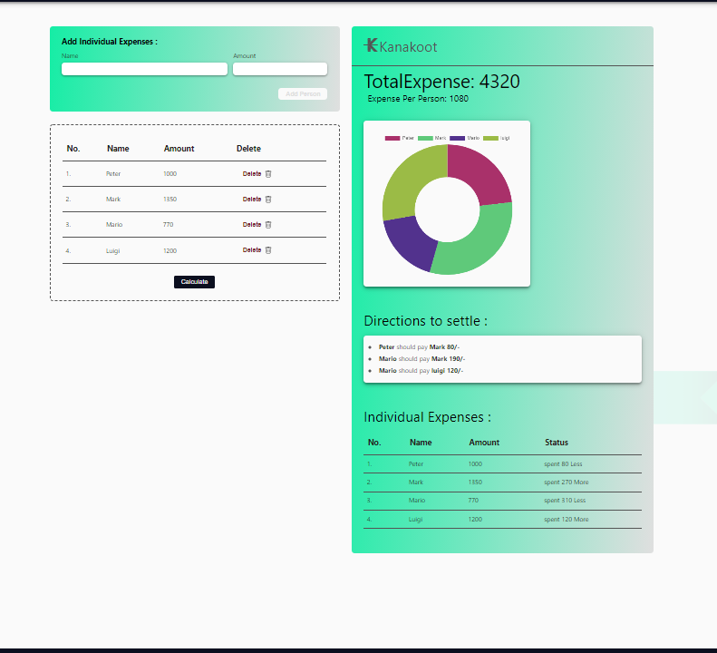

<p align="center">
  <a href="https://kanakoot.netlify.app">
    
  </a>
</p>
<h1 align="center">
  Kanakoot
</h1>
    <br/>
    <br/>
    <a href="https://github.com/gauthamkrishnax/Kanakoot"><strong>Explore the docs »</strong></a>
    <br/>
    <br/>
    <a href="https://kanakoot.netlify.app/">View Demo</a>
    .
    <a href="https://github.com/gauthamkrishnax/Kanakoot/issues">Report Bug</a>
    .
    <a href="https://github.com/gauthamkrishnax/Kanakoot/issues">Request Feature</a>
   <br/>
    <br/>


<a href="https://twitter.com/intent/tweet?text=Wow:&url=https%3A%2F%2Fgithub.com%2Fgauthamkrishnax%2FKanakoot"></a>

## Table Of Contents

- [About the Project](#about-the-project)
- [Built With](#built-with)
- [Usage](#usage)
- [Contributing](#contributing)
- [License](#license)
- [Authors](#authors)
- [Acknowledgements](#acknowledgements)

## About The Project

<br />
<br />


<br /><br />
---

- ### Kanakoot takes in your groups expense data and calculates the Total Expense, Expense per person, How much each owe or loaned and a efficient way to split the expense equally.

- ### Minimize your effort by providing only the name of the person and the amount spent or invested to get a detailed summary of all the expense calculations.

- ### Detects and directs how to make the transactions by providing the names of those who need to pay more and to whom they should pay.

---

## Built With

Gatsby and typescript + sass for styling. Hosted on Netlify.

1.  **Start developing.**

    Navigate into your new site’s directory and start it up.

    ```shell
    cd Kanakoot/
    npm run develop
    ```

2.  **Open the code and start customizing!**

    Your site is now running at http://localhost:8000!

    Edit `src/pages/index.js` to see your site update in real-time!

3.  **Learn more**

    - [Documentation](https://www.gatsbyjs.com/docs/?utm_source=starter&utm_medium=readme&utm_campaign=minimal-starter)

    - [Tutorials](https://www.gatsbyjs.com/tutorial/?utm_source=starter&utm_medium=readme&utm_campaign=minimal-starter)

    - [Guides](https://www.gatsbyjs.com/tutorial/?utm_source=starter&utm_medium=readme&utm_campaign=minimal-starter)

    - [API Reference](https://www.gatsbyjs.com/docs/api-reference/?utm_source=starter&utm_medium=readme&utm_campaign=minimal-starter)

    - [Plugin Library](https://www.gatsbyjs.com/plugins?utm_source=starter&utm_medium=readme&utm_campaign=minimal-starter)

    - [Cheat Sheet](https://www.gatsbyjs.com/docs/cheat-sheet/?utm_source=starter&utm_medium=readme&utm_campaign=minimal-starter)

## Usage

Visit [Calculator](https://kanakoot.netlify.app/calculator). Enter your Expense details and click calculate. Report will be generated.

## Contributing

Contributions are what make the open source community such an amazing place to be learn, inspire, and create. Any contributions you make are **greatly appreciated**.

- If you have suggestions for adding or removing projects, feel free to [open an issue](https://github.com/ShaanCoding/ReadME-Generator/issues/new) to discuss it, or directly create a pull request after you edit the _README.md_ file with necessary changes.
- Please make sure you check your spelling and grammar.
- Create individual PR for each suggestion.
- Please also read through the [Code Of Conduct](https://github.com/ShaanCoding/ReadME-Generator/blob/main/CODE_OF_CONDUCT.md) before posting your first idea as well.

### Creating A Pull Request

1. Fork the Project
2. Create your Feature Branch (`git checkout -b feature/AmazingFeature`)
3. Commit your Changes (`git commit -m 'Add some AmazingFeature'`)
4. Push to the Branch (`git push origin feature/AmazingFeature`)
5. Open a Pull Request

## License

Distributed under the MIT License. See  for more information.

## Authors

- **GauthamKrishna** - _UnderGraduate_ - [Gautham Krishna](https://github.com/gauthamkrishnax/) - _Computersciense_

## Acknowledgements

- [Gauthamkrishna](https://github.com/gauthamkrishnax/)
